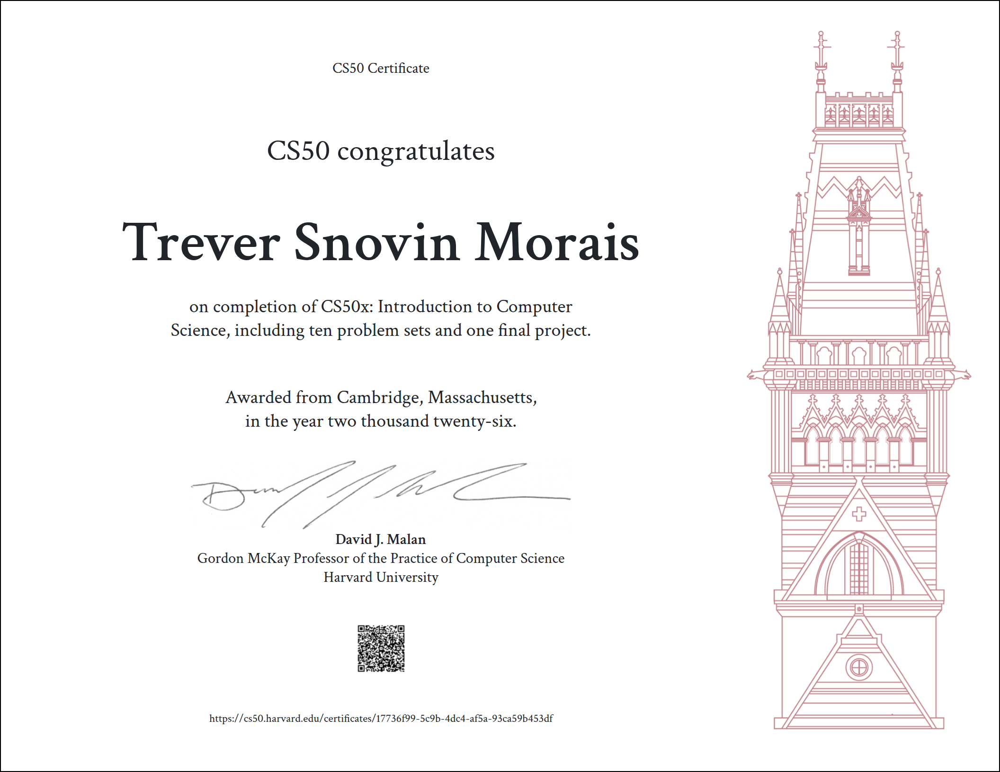

# Hey, I'm Trever,

A up-and-coming ECE undergrad who's into the point where software stops being abstract and starts touching actual hardware — firmware, silicon, the whole stack underneath the code. CS50 grad, and still chasing that "wait, that's how it works?" feeling with every new project.

## Achievements

### CS50

## What I'm exploring...

Embedded systems
VLSI & Semiconductor design
Website design

## Where I'm headed...

Long term, I want to be doing serious hardware-adjacent engineering — the kind of work happening at places like Qualcomm, Texas Instruments, Intel, NVIDIA, Bosch, and ISRO. Getting there one project at a time.

## Things I've built...

### Browser-based projects...

Loose Ends — a 2D ragdoll archery duel game. Flask + HTML5 Canvas + vanilla JS, verlet-integration physics, SQLite-backed progress and auth.

Finance app — a finance/stock market app. Flask + HTML5 Canvas + vanilla JS,  SQLite-backed progress and auth.

### C and Python projects...

**Speller** — a spell-checker in C using a hash table for fast lookup, loading a 140k+ word dictionary into memory and checking a document against it word-by-word.

**Caesar / Substitution** — command-line cryptography tools in C, encrypting text with classic Caesar-shift and general substitution ciphers, including full key validation.

**Runoff / Tideman** — Python implementations of ranked-choice and Condorcet-method voting algorithms, handling preference tallying and cycle detection.

**DNA** — a Python tool that identifies a person from a DNA sample by matching Short Tandem Repeat counts against a CSV database — the same technique used in real forensic analysis

### Scratch

My first CS50 project, built in Scratch before moving to C — a arcade style basketball game.
The `scratch-project.sb3` file is in this repo as a downloadable artifact — download it and open in the [Scratch desktop editor](https://scratch.mit.edu/download) or drag it into a project on [scratch.mit.edu](https://scratch.mit.edu) to run it.

Download: [scratch-project.sb3](./scratch-project.sb3)

## What I worked with...

<h4>Python — CS50 psets, the text-to-video CLI tool</h4>
<h4>C — CS50's early psets (Week 0-5 stuff), too show show my low-level fundamentals (coding close to hardware level)</h4>
<h4>Flask — Backend for running all my browser based projects</h4>
<h4>JavaScript — Frontend/game logic (vanilla JS, no framework)</h4>
<h4>HTML5 — specifically worth calling out Canvas since Loose Ends uses it for the game rendering</h4>
<h4>SQL / SQLite — CS50's cs50.SQL, plus progress/auth persistence</h4>
<h4>Git — version control, worth including even though it's implicit — it signals you actually work with proper workflows, not just zip-file submissions</h4>

## Connect

[Kennol Designs / portfolio] · treversnovin@gmail.com

## Fun fact
I also run a freelance graphic design studio on the side